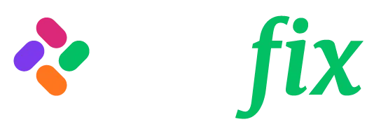

  

  **AI-Powered Physiotherapy Tracking System**
  
  

    
    
    
  

---

### 👋 About Us

**Fizifix** is an all-in-one platform designed for modern physiotherapists and clinics. We bridge the gap between clinics and patients by streamlining workflows and ensuring treatment compliance through advanced technology.

Our system combines **Artificial Intelligence** and **Movement Geometry** to provide a holistic assessment of patient exercises.

### 🚀 Key Features

*   **For Physiotherapists:**
    *   **Single Panel Management:** Manage all patients, appointments, and progress reports from one dashboard.
    *   **Data-Driven Decisions:** Track treatment processes with detailed performance analysis.
    *   **Secure Communication:** Message patients directly through a secure channel.

*   **For Patients:**
    *   **AI Guidance:** Instant audio and visual feedback to ensure correct exercise form using just a webcam.
    *   **Remote Access:** Professional-level tracking from the comfort of home.
    *   **Gamification:** Badges and streaks to keep motivation high during the recovery process.
